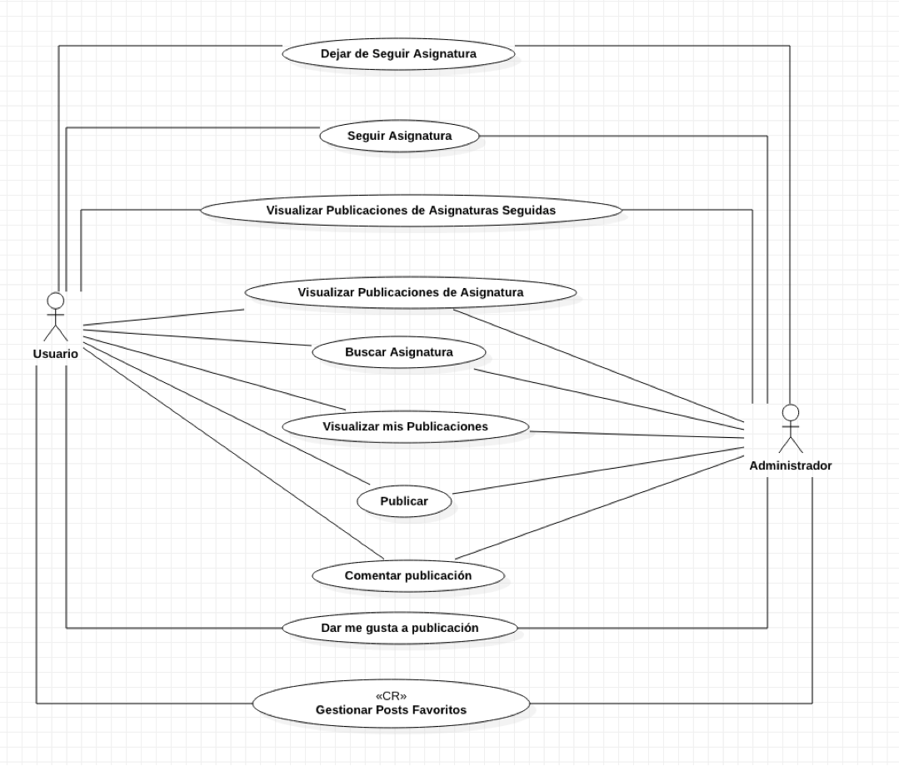
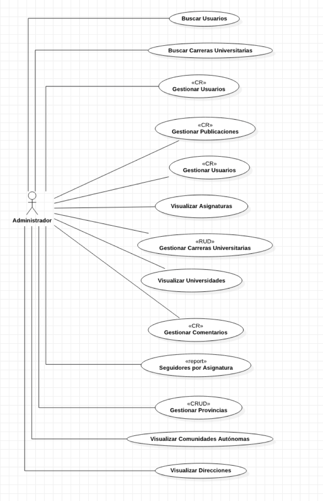

# Practica_3_JPA

El proyecto consiste en una aplicación web muy orientada a las redes sociales, de aquí en adelante la llamaremos “UniversityBook”, concretamente es una red social para estudiantes universitarios y profesores, pero con una particularidad, en esta red social no se siguen a personas, solamente podemos seguir asignaturas de distintas universidades. Con esta particularidad, lo que conseguimos es darles una mayor importancia a las asignaturas, y que las páginas de las asignaturas sean un espacio común de intercambio de ideas, documentos, enlaces, imágenes y textos entre los distintos estudiantes y profesores.
Principalmente, en la aplicación existen dos roles con distintas funcionalidades, el de usuario que pueden ser estudiante o profesor, ambos con las mismas funcionalidades. Y el de administrador de la aplicación, que abarca las funcionalidades del usuario y las amplia. Las funcionalidades de cada actor se describen con mayor detalle en el diagrama de casos de uso.
Una primera aproximación de la aplicación y un ejemplo de uso desde el punto de vista del usuario sería el siguiente.

El usuario para usar la aplicación tiene que iniciar sesión, por tanto, debe crearse una cuenta con sus datos personales, entre estos, tres parámetros a destacar, tipo de usuario (estudiante o profesor), universidad y carrera universitaria en la que estudia o da clases. La universidad y la carrera universitaria son valores que coinciden con la realidad en España, es decir, el usuario no introduce cualquier valor, sino que elige entre una lista de posibilidades que son dadas por el administrador de la aplicación.
Una vez ha iniciado sesión el usuario, en la pantalla principal aparecen todas las publicaciones de asignaturas que sigues. Una publicación consiste en un espacio en el cual visualizamos texto, enlaces, documentos, imágenes, y podemos darle me gusta y comentarlo. La publicación es visualizada en la ventana principal de cada usuario si siguen la asignatura y la publicación ha sido publicada en dicha asignatura, más adelante se explica con mayor detalle. Además, la aplicación nos ofrece opciones para ver nuestro perfil, configurar, cerrar sesión y buscar asignaturas.
En nuestro perfil visualizamos solamente nuestras publicaciones, es decir, las que nosotros hemos creado.

En la configuración, la aplicación nos permite cambiar nuestros datos personales, por ejemplo, contraseña, nombre, universidad, carrera, etc.

Para buscar una asignatura en concreto, por ejemplo, Arquitectura del Software, elegimos la universidad, la carrera y la asignatura. Por defecto, la universidad y la carrera son las que tiene establecido el usuario en su configuración. Igualmente, estos tres valores, universidad, carrera y asignatura, son buscados en una lista de posibilidades que ofrece el administrador de la aplicación, y coinciden con la realidad española. Por tanto, el usuario no puede seguir o crear una asignatura inexistente en los estudios universitarios españoles.
Una vez elegida una asignatura, por ejemplo, Arquitectura del Software, el usuario puede visualizar todas las publicaciones relacionadas con dicha asignatura que han publicado los distintos usuarios, ya sean estudiantes o profesores. Además, el usuario puede publicar en dicha asignatura o seguirla para que le aparezcan en su ventana principal todas las publicaciones de los distintos usuarios que han publicado en Arquitectura del Software. Por otro lado, si ya sigue la página, puede dejarla de seguir.
En el momento de publicar, el usuario puede publicar un texto, enlace, imagen o documento, por ejemplo, apuntes, diapositivas, etc. Obligatoriamente, al publicar debe de elegir una universidad, carrera universitaria, y asignatura. De esta manera, la publicación solo aparece en esa asignatura y la verán los usuarios que siguen Arquitectura del Software o busquen concretamente esa asignatura.

La aplicación podría tener muchas más funcionalidades como chat, filtrado por usuarios, documentos, fechas, me gustas, etc. Sin embargo, consideramos que como primera aproximación debemos fijar un alcance a la aplicación que vamos a implementar posteriormente.
Todas las funcionalidades descritas anteriormente o representadas en el diagrama de casos de uso nos permiten tener una idea general de la aplicación. Sin embargo, a lo largo de las distintas prácticas de la asignatura, se han implementado o se implementarán las funcionalidades necesarias para obtener un producto mínimo viable y para cubrir los requisitos de cada una de las prácticas.

En definitiva, UniversityBook es una mezcla del Moodle y Facebook, seleccionando funcionalidades de cada aplicación, y añadiendo otras adicionales.

## Casos de Uso

 

	

 

	

 

	

## Diagrama de Entidad-Relación

 

	

## Diagrama de Clases

[Diagrama de clases](Documentacion/DiagramaClases.pdf)

